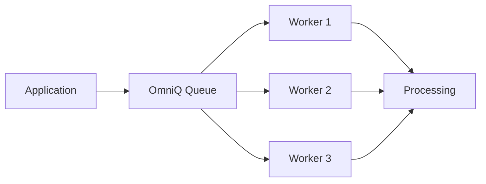
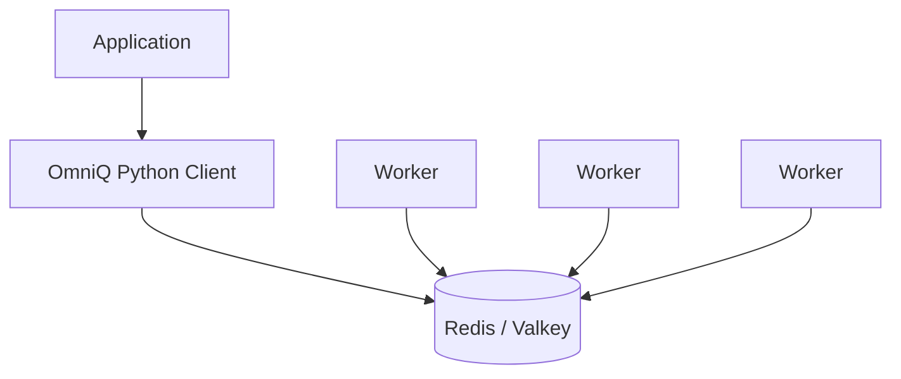
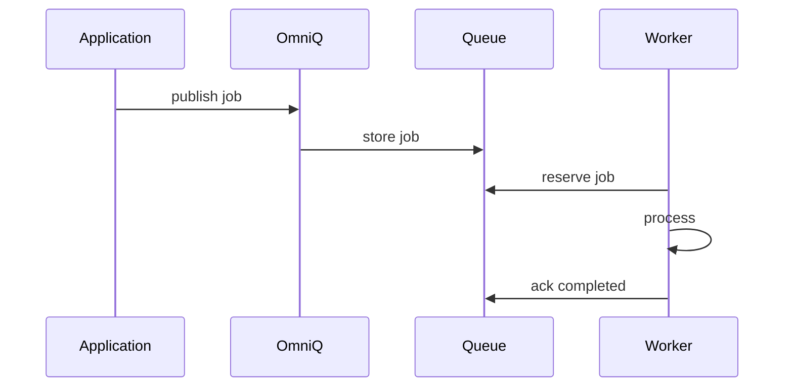
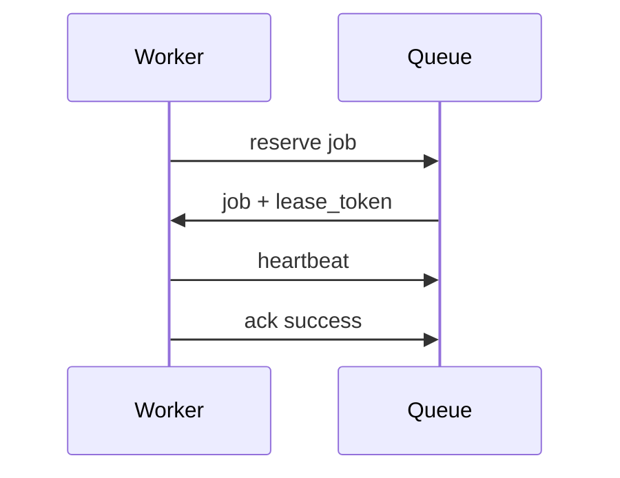
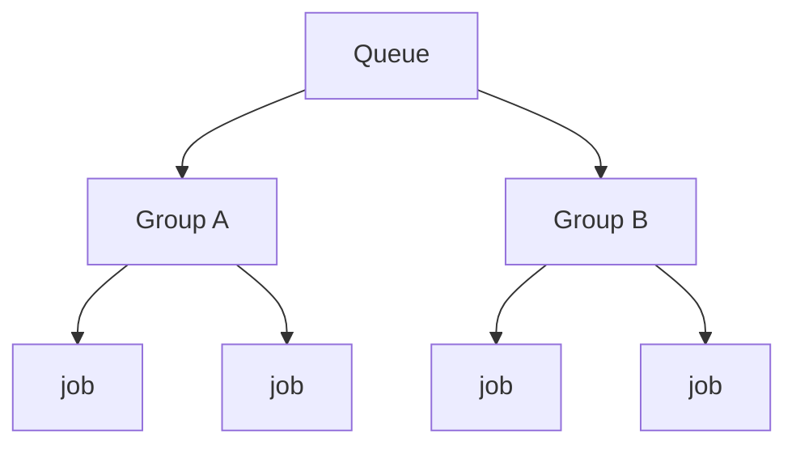
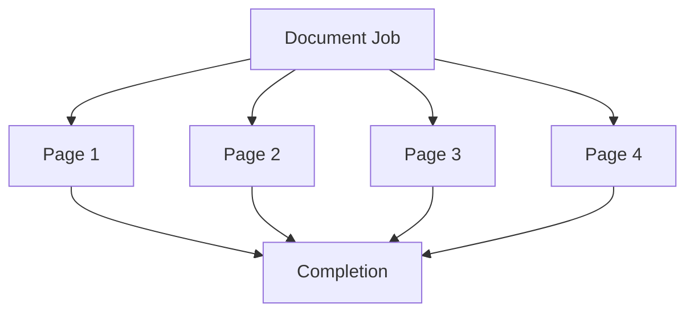
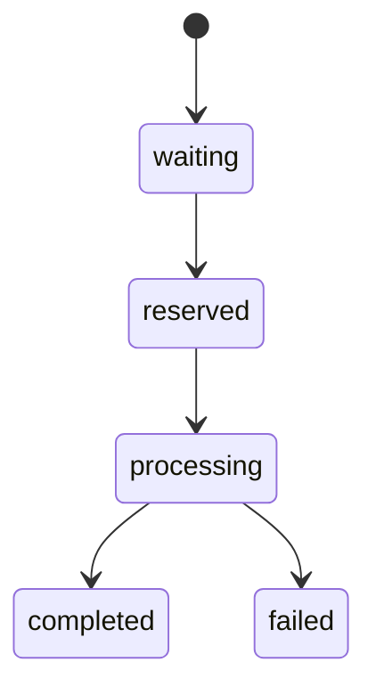

# OmniQ (Python)

OmniQ is a **distributed job queue built on top of Redis + Lua**, 
designed to run background tasks with **predictable execution,** 
**concurrency control, and distributed workflows**.

This package is the **official Python client for OmniQ v1**.

Core project:
[https://github.com/not-empty/omniq](https://github.com/not-empty/omniq)

------------------------------------------------------------------------

## The Story Behind OmniQ

Almost every modern system needs to execute tasks outside the main request flow.

Common examples include:

- sending emails
- generating reports or documents
- processing images or videos
- running data pipelines

At first, solving this problem seems simple.
You create a queue, add a few workers, and start processing jobs in the background.

But as the system grows, new challenges start to appear. Problems like 
**duplicate jobs, workers crashing mid-execution,or uncontrolled concurrency** 
become harder to manage with a simple queue.

Many existing solutions focus mainly on **moving messages**, but not on managing 
the **full lifecycle of a job execution**.

OmniQ was created to solve this problem by providing a more reliable model for 
running distributed background jobs, with explicit control over execution, 
concurrency, and task coordination.

------------------------------------------------------------------------

## How OmniQ Works

The core flow of OmniQ is simple.

An application publishes jobs, and workers process them.

```
Application
     │
     ▼
  OmniQ Queue
     │
     ▼
   Workers
     │
     ▼
 Processing
```

Or visually:



This allows multiple machines to work **in parallel** processing tasks.

------------------------------------------------------------------------

## System Architecture

OmniQ uses **Redis as its storage and coordination engine**.

The critical queue logic runs through **atomic Lua scripts**, ensuring consistent behavior even when multiple workers operate concurrently.

```
Application
     │
     ▼
   OmniQ Client
     │
     ▼
     Redis
     │
     ▼
   Workers
```

Or visually:



This architecture enables:

- distributed execution
- strong consistency under concurrency
- atomic operations
- automatic failure recovery

------------------------------------------------------------------------

## Core Concepts

Before using OmniQ, it helps to understand a few fundamental concepts.

------------------------------------------------------------------------

## Job

A **job** represents a unit of work that needs to be executed.

Examples of jobs:

- sending an email
- generating a report
- converting a video
- processing an image
- analyzing a file

Each job contains basic metadata:

```
Job
 ├─ id
 ├─ queue
 ├─ payload
 ├─ attempts
 └─ state
```

This allows the system to track the entire lifecycle of a task.

------------------------------------------------------------------------

## Payload

The **payload** contains the data required to execute the job.

It represents the **context of the task**.

Example:

Job: send email

```
payload
 ├─ to
 ├─ subject
 └─ template
```

Another example:

Job: generate report

```
payload
 ├─ company_id
 ├─ start_date
 └─ end_date
```

Visual representation:

```
Job
 ├─ type: generate_report
 └─ payload
     ├─ company_id
     ├─ start_date
     └─ end_date
```

Workers use the payload data to perform the work.

------------------------------------------------------------------------

## Publishing a Job

Publishing a job means **sending a task to the queue**.

When a job is published:

1. it receives a unique ID
2. it is stored in the queue
3. a worker can reserve and execute it

Flow:



Simplified view:

```
Application
     │
     ▼
 publish job
     │
     ▼
   Queue
     │
     ▼
   Worker
```

------------------------------------------------------------------------

## Queues

Jobs are organized into **queues**.

Each queue usually represents a type of workload.

Example queues:

```
emails
documents
images
payments
reports
```

Visualization:

```
Queue: emails

 ├─ job1
 ├─ job2
 └─ job3
```

Workers may consume jobs from **one or multiple queues**.

------------------------------------------------------------------------

## Lease-Based Execution

OmniQ uses a **lease-based execution model**.

When a worker reserves a job, it receives a **temporary lease**.

```
Worker reserves job
        │
        ▼
Job becomes locked to that worker
        │
        ▼
Worker processes it
```

Diagram:



If the worker crashes:

- the lease expires
- the job becomes available again

This prevents jobs from becoming **permanently stuck**.

------------------------------------------------------------------------

## Heartbeats

Some jobs may take a long time to finish.

Examples include:

- video processing
- large data analysis
- heavy report generation

Workers can send **heartbeats** to extend the lease.

```
Worker
 ├─ start job
 ├─ heartbeat
 ├─ heartbeat
 └─ finish job
```

This tells the system that the job **is still actively running**.

------------------------------------------------------------------------

## Grouped Jobs

OmniQ supports grouping jobs using **groups**.

This is useful when you need to limit concurrency within a logical group.

Example: processing jobs per customer.

```
Queue: payments

Group A (customer A)
 ├─ job1
 └─ job2

Group B (customer B)
 ├─ job3
 └─ job4
```

Guarantees:

- **FIFO ordering within a group**
- groups run **in parallel**
- configurable concurrency limits per group

Diagram:



------------------------------------------------------------------------

## Ungrouped Jobs

Jobs can also be published **without a group**.

```
Queue

 ├─ job A
 ├─ job B
 └─ job C
```

OmniQ uses a **round-robin strategy** to maintain fairness between grouped and ungrouped jobs.

------------------------------------------------------------------------

## Workflows with Child Jobs

Some tasks need to be split into smaller pieces.

For example: processing a multi-page document.

```
Document Job
   │
   ▼
Split into pages
```

Diagram:



Each page can be processed by **a different worker**, enabling massive parallel processing.

------------------------------------------------------------------------

## Child Job Coordination

OmniQ provides a simple mechanism to coordinate these child jobs.

Each child reports when it finishes:

```
Page 1 → done
Page 2 → done
Page 3 → done
Page 4 → done
```

Internally, a **remaining jobs counter** is tracked.

Example:

```
Remaining = 4

Child 1 finished → Remaining = 3  
Child 2 finished → Remaining = 2  
Child 3 finished → Remaining = 1  
Child 4 finished → Remaining = 0
```

When the counter reaches **zero**, the workflow can continue.

Key properties:

- idempotent
- safe for retries
- works across different queues
- does not depend on TTL

------------------------------------------------------------------------

## Job States

During its lifecycle, a job transitions through several states.



This makes the system state **observable and traceable**.

------------------------------------------------------------------------

## Administrative Operations

OmniQ provides safe administrative operations for queue management.

Examples:

- retry failed jobs
- remove jobs
- pause queues
- resume queues

These operations run through **atomic Lua scripts**, ensuring consistency even under high concurrency.

------------------------------------------------------------------------

## When to Use OmniQ

OmniQ is a good fit for systems that need to:

- run background tasks reliably
- control concurrency
- coordinate distributed pipelines
- split large workloads into smaller jobs
- prevent duplicate execution
- maintain operational reliability

Common use cases include:

- document processing
- data pipelines
- media processing
- report generation
- backend automation

------------------------------------------------------------------------

## Installation

```
pip install omniq
```

------------------------------------------------------------------------

## Examples

Complete examples are available in:

```
./examples
```

They include:

- publishing jobs
- basic workers
- structured payloads
- parent/child workflows
- queue coordination

------------------------------------------------------------------------

## License

See the license file in the repository.

------------------------------------------------------------------------